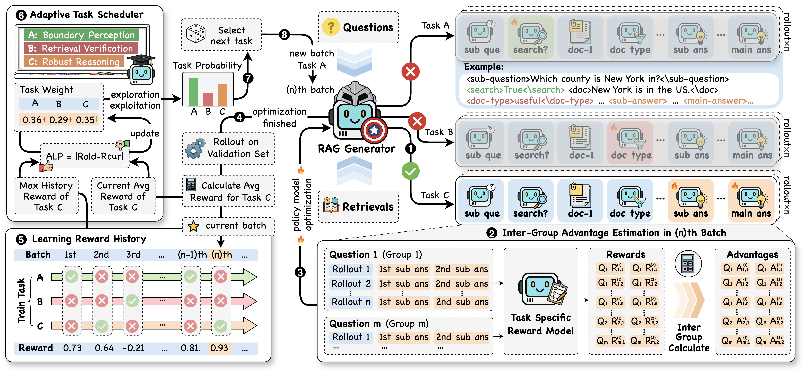

<div align="center">

# ARMOR: Adaptive Curriculum Meta-Learning for Noise-Robust RAG Reasoning

**Yan Wang\*, Yuxin Zhang\*, Shenyu Zhang, Yongrui Chen, Sheng Bi, Guilin Qi†**

*Southeast University*

**Accepted to IJCAI-ECAI 2026**

</div>

---

## 🔍 Overview

Retrieval-Augmented Generation (RAG) mitigates LLM hallucinations by grounding generation in external knowledge — yet retrieval is inherently imperfect. Irrelevant or misleading **retrieval noise** inevitably leaks into the context and can severely degrade the quality of generated answers.

**Our key observation:** noise robustness is *not* a standalone trait, but a **composite competency** that spans three distinct dimensions:

| Sub-task | Question it answers |
|---|---|
| 🧭 **Knowledge Boundary Perception** | *"Do I need to retrieve at all?"* |
| 🔎 **Retrieval Verification** | *"Which retrieved documents are actually useful?"* |
| 🧠 **Robust Reasoning** | *"Can I still reason correctly in a noisy context?"* |

Most existing methods optimize only one of these facets in isolation. Directly applying standard RL to optimize all three jointly runs into two fundamental obstacles:

- **⚔️ Reward interference.** Heterogeneous optimization objectives interfere with — or even cancel — each other within a single policy update, preventing convergence on any specific capability.
- **🪜 Missing curriculum.** These capabilities follow a natural progressive order (just as a student learns addition before multiplication). Standard RL ignores this progression and optimizes everything simultaneously, overwhelming the generator.

## ✨ Our Approach: ARMOR

Inspired by human teaching, **ARMOR** models robustness training as an **adaptive curriculum meta-learning** process, with a *Teacher* curating what to learn and a *Student* learning it:

<p align="center">
  
</p>

1. **Adaptive Task Scheduler (Teacher).** In each training round, the scheduler decomposes robustness into the three sub-tasks above and selects exactly one to optimize, based on the student's **Absolute Learning Progress (ALP)** — always prioritizing the capability with the highest potential for improvement. An exploration–exploitation balance prevents premature convergence. By focusing on a single objective at a time, ARMOR effectively eliminates reward interference.

2. **RAG Generator (Student).** The generator produces rollouts for the selected task under realistic noisy retrieval, following a structured *retrieve → verify → reason* workflow (see [Inference Workflow](#-inference-workflow)).

3. **Inter-Group Advantage Estimation (IGAE).** With the output space constrained to a single sub-task, rollouts from the same input become highly similar, and GRPO's intra-group advantage normalization yields vanishing learning signals and risks mode collapse. ARMOR instead normalizes advantages over the **entire training batch**, providing stable supervision across heterogeneous sub-tasks.

Together with tailored reward functions for each sub-task, ARMOR learns the three capabilities *synergistically* rather than in conflict.


## 📁 Repository Structure

```
Code&Dataset/
├── code/
│   ├── WarmUp/                          # Stage 1: supervised fine-tuning (warm-up)
│   │   ├── train.py                     #   LoRA SFT training script
│   │   ├── data_utils.py                #   Dataset loading, special tokens, doc-content masking
│   │   ├── retriever.py                 #   E5 dense retriever
│   │   ├── inference.py                 #   ARMOR RAG inference engine (dynamic retrieval + noise injection)
│   │   ├── test.py                      #   Batch evaluation script (incremental saving, noise-ratio sweep)
│   │   ├── train-WarmUp.sh              #   Reference launch script
│   │   └── model_spedific_warmup_dataset_demo/   # Example of model-specific warm-up data (labeled)
│   │
│   └── RL/                              # Stage 2: reinforcement learning (GRPO + adaptive curriculum)
│       ├── grpo_trainer.py              #   Main trainer (DDP, rollout → reward → update)
│       ├── task_schedular.py            #   Adaptive task scheduler (ALP-based Teacher)
│       ├── rollout.py                   #   Rollout sampling with dynamic retrieval
│       ├── reward_cal.py                #   Reward functions for the three sub-tasks
│       ├── optimizer.py                 #   GRPO optimizer with inter-group advantage estimation
│       ├── rl_data_utils.py             #   RL dataset loading
│       ├── llm_invoke.py                #   LLM-as-evaluator utilities
│       ├── prompt/                      #   Evaluation / judging prompts
│       └── train-RL.sh                  #   Reference launch script
│
└── dataset/
    ├── train_warmup.json                # Raw multi-hop warm-up set (no retrieval labels, see below)
    ├── train_rl.json                    # RL training set
    ├── val_sectional.json               # Validation subset
    ├── test_2WikiMultiHopQA_sectional.json
    ├── test_MusiQue_sectional.json
    └── test_HotpotQA_sectional.json     # OOD test subset
```

## 🚀 Getting Started

### 1. Environment

The code is built on PyTorch + Hugging Face Transformers. Core dependencies:

```bash
pip install torch transformers peft accelerate modelscope chromadb python-dotenv
```

Set the path to the E5 retriever checkpoint (used in both stages):

```bash
export E5_MODEL_PATH=/path/to/e5-base-v2
```

### 2. Prepare Warm-Up Data (model-specific retrieval labeling)

The released `train_warmup.json` provides multi-hop reasoning chains **without** per-hop retrieval decisions — because *whether a hop should retrieve depends on the specific generator being trained*. Before warm-up training, label each sub-question for your target model:

> For every sub-question in the chain, let the model answer it **without** retrieval.
> - If it answers correctly → set `retrieval: false` (the model's intrinsic knowledge suffices);
> - otherwise → set `retrieval: true` (external evidence is required).

A fully labeled example for Qwen3-0.6B is provided in `WarmUp/model_spedific_warmup_dataset_demo/` for reference. The labeled data format is shown in [Warm-Up Data Format](#warm-up-data-format).

### 3. Build (or Download) the Retrieval Index

Inference retrieves from per-dataset **ChromaDB** collections (`2WikiMultiHopQA`, `MusiQue`, `HotpotQA`, collection name `doc`). Either build them from the reconstructed document pools, or download the pre-built indexes:

> 📦 Pre-built ChromaDB indexes: *#TODO: Google Drive link*

Update the `*_chroma_file_dic` paths in `WarmUp/inference.py` accordingly.

### 4. Warm-Up Training (Stage 1)

SFT with LoRA teaches the generator the structured *decompose → retrieve → verify → reason* workflow:

```bash
cd Code&Dataset/code/WarmUp
bash train-WarmUp.sh     # edit MODEL_NAME / paths inside first
```

After training, **merge the LoRA adapter into the base model** (e.g., `PeftModel.merge_and_unload()`), since the RL stage trains on the merged checkpoint (`--policy_model_path`).

### 5. RL Training (Stage 2)

GRPO training with the adaptive task scheduler and inter-group advantage estimation:

```bash
cd Code&Dataset/code/RL
bash train-RL.sh         # edit MODEL_NAME / paths inside first
```

Key arguments in `train-RL.sh`:

| Argument | Description |
|---|---|
| `--policy_model_path` | Merged warm-up checkpoint (the student) |
| `--reward_model_path` | Local LLM used as the judge for answer correctness (Qwen3-4B in our runs) |
| `--batch_size` / `--rollout_num` | Questions per round (10) / rollouts per question (2) |
| `--temperature`, `--top_p`, `--top_k` | Sampling hyperparameters (0.85 / 0.95 / 50) |

Multi-GPU training is supported via `torchrun --nproc_per_node=N`. The scheduler logs the task-selection probabilities $p_n(\tau)$ each round, so you can watch the curriculum evolve.

### 6. Inference & Evaluation

`WarmUp/test.py` runs batch evaluation with incremental result saving:

```bash
python test.py \
    --base_model_path /path/to/base-model \
    --lora_adapter_path /path/to/lora-adapter \
    --e5_model_path $E5_MODEL_PATH \
    --prompt_file_path prompt.txt \
    --test_file_path ../../dataset/test_2WikiMultiHopQA_sectional.json \
    --output_file_path results/2wiki_test.json \
    --retriever_topk 3 \
    --noise_ratio 0.0      # optional: inject noisy docs at a fixed ratio (robustness testing)
```

We report **Exact Match (EM)**, **F1**, and **Correctness (Cor.)** — the last one is an LLM-judged semantic-accuracy score normalized to [0, 1], since surface-matching metrics undercount valid answers in generative QA.

## 🧾 Data Formats

### Warm-Up Data Format

Each sample pairs a main question with a structured reasoning chain. Note the `retrieval`, `retrieval_info` and `retrieval_golden` fields — they come from the model-specific labeling step described above:

```json
{
    "id": "795_2Wiki_train",
    "data_source": ["2WikiMultiHopQA", "train", 795],
    "main_question": "Are director of film My Own United States and director of film Anton (1973 film) from the same country?",
    "main_answer": "no",
    "chain_of_thought": [
        {
            "think": "To determine if the directors are from the same country, I first need to identify the director of the film *Anton (1973 film)*.",
            "sub_question": "Who is the director of the film Anton (1973 film)?",
            "retrieval": true,
            "doc": "Anton is a 1973 Norwegian drama film written and directed by Per Blom, starring Bjørn Erik Jessen.",
            "doc_type": "golden",
            "sub_answer": "The 1973 film Anton was directed by Per Blom.",
            "evidence": ["Anton (1973 film)", "director", "Per Blom"],
            "retrieval_info": [
                "Anton is a 1973 Norwegian drama film written and directed by Per Blom, starring Bjørn Erik Jessen.",
                "Ian Barry is an Australian director of film and TV.",
                "Howard Winchel Koch( April 11, 1916 – February 16, 2001) was an American producer and director of film and television."
            ],
            "retrieval_golden": true
        },
        {
            "think": "Finally, I need to find the country of citizenship of John W. Noble, the director of *My Own United States*, to complete the comparison.",
            "sub_question": "What is the country of citizenship of John W. Noble?",
            "retrieval": false,
            "doc": "John Winthrop Noble( born Winfield Fernley Kutz; June 24, 1880 – September 10, 1946) was an American film director and screenwriter during the silent era.",
            "doc_type": "golden",
            "sub_answer": "John W. Noble is an American citizen.",
            "evidence": ["John W. Noble", "country of citizenship", "American"]
        }
    ],
    "extra_info": { "subset_split": "train_warmup", "sub_set_index": 0 }
}
```

Field semantics:

| Field | Meaning |
|---|---|
| `retrieval` | Whether this hop requires external retrieval (**model-specific label**) |
| `doc` | The golden document for this hop |
| `retrieval_info` | Documents actually returned by the retriever for this hop |
| `retrieval_golden` | Whether the retriever managed to return the golden document (if `false`, the golden `doc` is appended as a candidate, simulating a noisy but recoverable retrieval) |

### RL Data Format

RL samples carry the reasoning chain **without** retrieval decisions (`retrieval: []`) — the policy is free to explore its own retrieve/verify/reason behavior, and rewards come from the task-specific reward functions:

```json
{
    "id": "12596_2Wiki_train",
    "data_source": ["2WikiMultiHopQA", "train", 12596],
    "main_question": "What is the place of birth of the performer of song Figure It Out (French Montana Song)?",
    "main_answer": "Atlanta",
    "chain_of_thought": [
        {
            "think": "To determine the place of birth of the performer, I first need to identify who performed the song *Figure It Out*.",
            "sub_question": "Who is the performer of the song Figure It Out?",
            "retrieval": [],
            "doc": "\"Figure It Out\" is a single by American rapper French Montana, featuring Kanye West and Nas.",
            "doc_type": "golden",
            "sub_answer": "Figure It Out is performed by Kanye West.",
            "evidence": ["Figure It Out", "performer", "Kanye West"]
        },
        {
            "think": "Now that I know Kanye West is the performer, I can find his place of birth to answer the main question.",
            "sub_question": "Where was Kanye born?",
            "retrieval": [],
            "doc": "Born in Atlanta and raised in Chicago, West first became known as a producer for Roc-A-Fella Records in the early 2000s...",
            "doc_type": "golden",
            "sub_answer": "Kanye's place of birth is Atlanta.",
            "evidence": ["Kanye", "place of birth", "Atlanta"]
        }
    ],
    "extra_info": { "subset_split": "train_rl", "sub_set_index": 0 }
}
```

### Special Tokens

The generator's output is organized by special tokens that delimit each reasoning step:

| Token | Purpose |
|---|---|
| `<main-question>` / `</main-question>` | Main question delimiters |
| `<think>` / `</think>` | Reasoning / planning for the current hop |
| `<sub-question>` / `</sub-question>` | Decomposed sub-question |
| `<search>` / `</search>` | Retrieval decision (`True` / `False`) — knowledge boundary perception |
| `<doc>` / `</doc>` | Retrieved document content (masked during SFT loss) |
| `<doc-type>` / `</doc-type>` | Usefulness judgement of the document — retrieval verification |
| `<sub-answer>` / `</sub-answer>` | Answer to the sub-question |
| `<main-answer>` / `</main-answer>` | Final answer to the main question |

## 🖼️ Inference Workflow

A complete ARMOR inference trace decomposes the main question hop by hop, decides per hop whether to retrieve, verifies each returned document, and composes the final answer:

<p align="center">
  
</p>

## 📖 Citation

If you find ARMOR useful in your research, please consider citing:

```bibtex
@inproceedings{wang2026armor,
  title     = {ARMOR: Adaptive Curriculum Meta-Learning for Noise-Robust RAG Reasoning},
  author    = {Wang, Yan and Zhang, Yuxin and Zhang, Shenyu and Chen, Yongrui and Bi, Sheng and Qi, Guilin},
  booktitle = {Proceedings of the Thirty-Fifth International Joint Conference on Artificial Intelligence (IJCAI-ECAI)},
  year      = {2026}
}
```

## 📮 Contact

For questions or issues, please open a GitHub issue or contact us at `yanwangstu@seu.edu.cn`.
